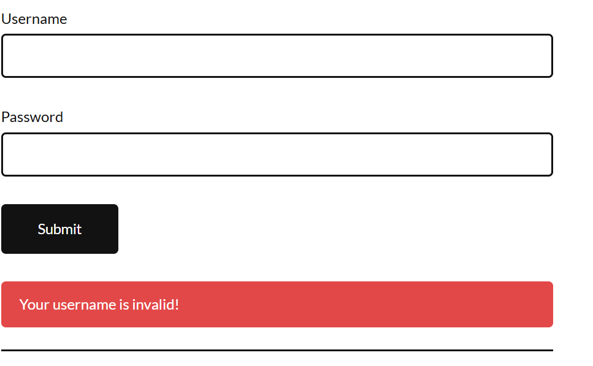
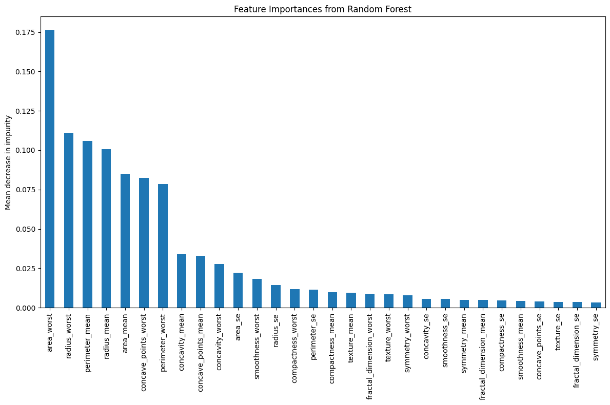

# 🎯 AI in Software Engineering Assignment  
**Theme: Building Intelligent Software Solutions**   

---

## 📝 **Assignment Breakdown**  
| Component               | Deliverable          | Weight |  
|-------------------------|----------------------|--------|  
| Theoretical Analysis    | PDF Report           | 30%    |  
| Code Implementation     | GitHub Repo          | 50%    |  
| Ethical Reflection      | Markdown File        | 10%    |  
| Presentation            | 3-min Video          | 10%    |  

---

## 🧠 **Part 1: Theoretical Analysis**  

### Q1: AI Code Generation  
**Benefits**:  
```diff
+ 40% faster development time  
+ Context-aware suggestions

---

## 🤖 Part 2: Practical Implementation

### 🔸 Task 1: AI-Powered Code Completion

📂 **File:** `task1_code_completion.py`

Description:  
Python function to sort a list of dictionaries using both AI-generated and manual code.

---

### 🔸 Task 2: Automated Testing with AI

📂 **File:** `task2_login_test.py`

Description:  
Selenium-based automated test for login functionality (valid/invalid credentials).

**Screenshots:**  

✅ Valid Login:  
  

❌ Invalid Login:  
  

---

### 🔸 Task 3: Predictive Analytics for Resource Allocation

📂 **File:** `task3_predictive_analytics.ipynb`

Description:  
Random Forest model trained on Breast Cancer Dataset to predict issue priority (high/medium/low).  
Includes evaluation using accuracy and F1-score.

📊 Graph:  


---
